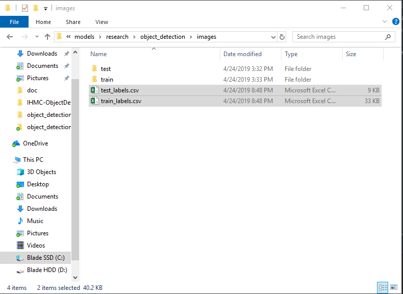

# How To Train Object Detection Model Using TensorFlow GPU on Windows 10

## Introduction
This is a tutorial on how to train your own object detection model. If you are starting from the scratch, I recommend that you reference this [tutorial on Youtube](https://www.youtube.com/watch?v=Rgpfk6eYxJA).

## Set up Anaconda enviroment
In order to train an object detection model using tensorflow, you need to setup Anaconda enviroment and install TensorFlow-GPU.

Here are some helpful links to setup tensorflow GPU

[Python Enviroment Setup for Deep Learning](https://towardsdatascience.com/python-environment-setup-for-deep-learning-on-windows-10-c373786e36d1)

[tutorial on Youtube](https://www.youtube.com/watch?v=Rgpfk6eYxJA).

## Test Door Detection Model
Once you have installed tensorflow GPU and Anaconda enviroment setup, test out my door detection model.

- Make a new folder in your C: drive named tensorflow1
- Download the full TensorFlow object detection repository located at
https://github.com/tensorflow/models by clicking the “Clone or Download” button and downloading the zip file.
- Open the downloaded zip file and extract the “models-master” folder directly into the C:\tensorflow1 directory you just created.
- Rename “models-master” to just “models”.

Download this repository

- copy all files and paste them to C:\tensorflow1\models\research\object_detection folder
- move image_util.py and object_enum.py files to utils folder
- open Object_detector file in models/research/object_detection folder
- change directory for saving images in line 77 and 99.


To test it out,
- open up Object_detection_server in models/research/object_detection
- type in host ip and port. Run Python server.

<p align="center">
  
</p>

- download socket folder in the repository
- open it up using Eclipse or IntelliJ.
- type in local host ip and the same port.

<p align="center">
  
</p>

When you run it, you will see that the server receives image from the client and sends back detection box coordinates in [object number, xmin, xmax, ymin, ymax] format.

<p align="center">
  
</p>

door image sent:
<p align="center">
  
</p>

door image saved after detection
<p align="center">
  
</p>

If you get this image above, your enviroment is set up and ready to train your own model
## Train models for other objects

If you want to train your own models for other objects, follow these steps below.

### 0.
- Empty inference_graph folder (or if you want to keep door detection model, name frozen_inference_graph differently and keep it so you can call this file when you want to use detect door. You can delete everyting else.)
- Empty images/train and images/test folders. Also delete two csv files in images folder.
- delete all files in training folder *except* faster_rcnn_inception_v2_pets.config file and labelmap.pbtxt file.

### 1. Gather and Label Pictures

#### 1a. Gathering Pictures
- collect hundreds of images of object you want to detect with a variety of background and from many different angles and distances. I used my phone to take pictures.
- If you are using your phone to take pictures, pictures might appear rotated 90 degree in labelling app even though they are upright in image viewer. If that is the case, use auto rotation application to auto rotate pictures. Make sure they are upright in labelling app before resizing.
- I resized all images to 900 x 1200 to make image sizes smaller (150~300kb). Use image resizer Java file in the repository.

#### 1b. Label Pictures
- put 20% of your images in object_detection/images/test folder and 80% in  object_detection/images/train folder.
- download [LabelImg GitHub link](https://github.com/tzutalin/labelImg)
- Label all images using LabelImg app. Use shortcuts: w - label box, d - next, a - previous, ctrl + s - save. (Make sure save directory is the same as the directory you opened.)
- this will create xml files for each image file in both images/test and images/train folder.


### 2. Configure PYTHONPATH enviroment variable

- Open anaconda command prompt
- activate the enviroment by issuing:
```
C:\> activate tensorflow1
```
- A PYTHONPATH variable must be created that points to the \models, \models\research, and \models\research\slim directories. Do this by issuing the following commands (from any directory):
```
(tensorflow1) C:\> set PYTHONPATH=C:\tensorflow1\models;C:\tensorflow1\models\research;C:\tensorflow1\models\research\slim
```
(Note: Every time the "tensorflow1" virtual environment is exited, the PYTHONPATH variable is reset and needs to be set up again.)

### 3. Generate Training Data

#### 3a. Create csv File
With the images labeled.pbtxt, generate the TFRecords that serve as input data to the TensorFlow training model. This tutorial uses the xml_to_csv.py and generate_tfrecord.py scripts from [Dat Tran’s Raccoon Detector dataset](https://github.com/datitran/raccoon_dataset), with some slight modifications to work with our directory structure.

- change your directory to object_detection
- run this in anaconda command

```
(tensorflow1) C:\tensorflow1\models\research\object_detection> python xml_to_csv.py
```
This creates a train_labels.csv and test_labels.csv file in the \object_detection\images folder.

<p align="center">
  
</p>

#### 3b. Create TFRecords

Now, open labelmap in object_detection/training folder and change labels accordingly.

```
item {
  id: 1
  name: 'door'
}

item {
  id: 2
  name: 'doorHandle'
}
```

Open the generate_tfrecord.py file in a text editor. Replace the label map starting at line 31 with your own label map, where each object is assigned an ID number. This same number assignment will be used when configuring the labelmap.pbtxt file in previous step.

<p align="center">
  
</p>


then in your Anaconda command prompt, run this:

```
python generate_tfrecord.py --csv_input=images\train_labels.csv --image_dir=images\train --output_path=train.record
python generate_tfrecord.py --csv_input=images\test_labels.csv --image_dir=images\test --output_path=test.record
```

this creates train.record and test.record in object_detection folder.

#### 3c. configure faster_rcnn_inception_v2_pets.config
Open faster_rcnn_inception_v2_pets.config in training folder.

- Line 9. Change num_classes to the number of different objects you want the classifier to detect. For my door detection model, it would be num_classes : 2 .
- Line 110. Change fine_tune_checkpoint to:
  - fine_tune_checkpoint : "C:/tensorflow1/models/research/object_detection/faster_rcnn_inception_v2_coco_2018_01_28/model.ckpt"

- Lines 126 and 128. In the train_input_reader section, change input_path and label_map_path to:
  - input_path : "C:/tensorflow1/models/research/object_detection/train.record"
  - label_map_path: "C:/tensorflow1/models/research/object_detection/training/labelmap.pbtxt"

- Line 132. Change num_examples to the number of images you have in the \images\test directory.

- Lines 140 and 142. In the eval_input_reader section, change input_path and label_map_path to:
  - input_path : "C:/tensorflow1/models/research/object_detection/test.record"
  - label_map_path: "C:/tensorflow1/models/research/object_detection/training/labelmap.pbtxt"

Save the file after the changes have been made. That’s it! The training job is all configured and ready to go!

### 4. Run the Training

From the \object_detection directory, issue the following command to begin training:
```
python train.py --logtostderr --train_dir=training/ --pipeline_config_path=training/faster_rcnn_inception_v2_pets.config
```
If everything has been set up correctly, TensorFlow will initialize the training. The initialization can take up to 30 seconds before the actual training begins. When training begins, it will look like this:

<p align="center">
  
</p>

Each step of training reports the loss. It will start high and get lower and lower as training progresses. For my training on the Faster-RCNN-Inception-V2 model, it started at about 3.0 and quickly dropped below 0.8. I recommend allowing your model to train until the loss consistently drops below 0.05, which will take about 40,000 steps, or about 2 hours (depending on how powerful your CPU and GPU are). Note: The loss numbers will be different if a different model is used. MobileNet-SSD starts with a loss of about 20, and should be trained until the loss is consistently under 2.

You can view the progress of the training job by using TensorBoard. To do this, open a new instance of Anaconda Prompt, activate the tensorflow1 virtual environment, change to the C:\tensorflow1\models\research\object_detection directory, and issue the following command:
```
(tensorflow1) C:\tensorflow1\models\research\object_detection>tensorboard --logdir=training
```
This will create a webpage on your local machine at YourPCName:6006, which can be viewed through a web browser. The TensorBoard page provides information and graphs that show how the training is progressing. One important graph is the Loss graph, which shows the overall loss of the classifier over time.

<p align="center">
  
</p>

The training routine periodically saves checkpoints about every five minutes. You can terminate the training by pressing Ctrl+C while in the command prompt window. I typically wait until just after a checkpoint has been saved to terminate the training. You can terminate training and start it later, and it will restart from the last saved checkpoint. The checkpoint at the highest number of steps will be used to generate the frozen inference graph.

### 5. Export Inference Graph
Now that training is complete, the last step is to generate the frozen inference graph (.pb file). From the \object_detection folder, issue the following command, where “XXXX” in “model.ckpt-XXXX” should be replaced with the highest-numbered .ckpt file in the training folder:
```
python export_inference_graph.py --input_type image_tensor --pipeline_config_path training/faster_rcnn_inception_v2_pets.config --trained_checkpoint_prefix training/model.ckpt-XXXX --output_directory inference_graph
```
This creates a frozen_inference_graph.pb file in the \object_detection\inference_graph folder. The .pb file contains the object detection classifier.

### 6. Use Your Newly Trained Object Detection Classifier
The object detection classifier is all ready to go.
